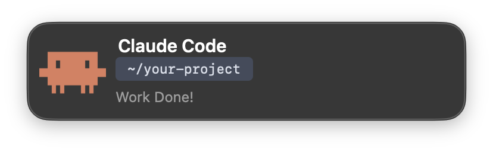
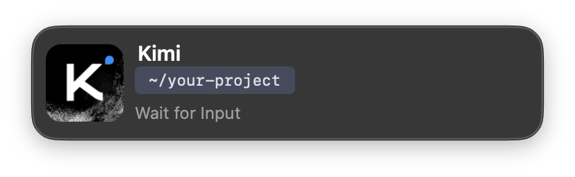

# CodePing

> 为 AI 编程助手打造的精美 macOS 弹窗 & iPhone 推送通知工具。AI 完成思考时，不再错过。

[](https://www.apple.com/macos/)
[](LICENSE)

[English](README.md) · [中文](README.zh.md)

当你的 AI 编程助手停止响应时——无论是任务完成、等待输入还是会话结束——CodePing 会在你当前活跃显示器上弹出一个精致的 macOS 原生面板。搭配 [Bark](https://github.com/Finb/Bark) 使用，同一时刻你的 iPhone 也会收到推送。

**已支持：** [Claude Code](https://claude.ai/code) · [Kimi CLI](https://platform.kimi.com/)

---

## ✨ 功能亮点

- **多 CLI 支持** — 自动识别 Claude Code、Kimi CLI，更多支持即将到来
- **独立品牌标识** — 每个 AI 助手在弹窗和 iPhone 推送中都有专属图标
- **原生 macOS 弹窗** — 毛玻璃质感面板，连续圆角，自动适配深色/浅色模式，附带系统 Glass 提示音
- **多显示器感知** — 弹窗始终出现在你鼠标当前所在的屏幕
- **一键回切** — 点击通知即可跳回正在使用的终端应用（Ghostty、iTerm2、Terminal.app 等）
- **悬停关闭** — 优雅的关闭按钮在鼠标悬停时淡入显示
- **iPhone 同步** — 通过 [Bark](https://apps.apple.com/app/bark-customed-notifications/id1403753865) 经 APNs 实时推送至手机

---

## 📸 效果预览




*与你的 macOS 主题一致的毛玻璃面板，在活跃桌面丝滑弹出。图标会根据触发通知的 CLI 自动切换。*

---

## 🚀 快速开始

<details open>
<summary><b>Claude Code（插件）</b></summary>

在 Claude Code 设置中注册本仓库为插件市场（`~/.claude/settings.json`）：

```json
{
  "extraKnownMarketplaces": {
    "zeppelinpp": {
      "source": {
        "source": "github",
        "repo": "Zeppelinpp/CodePing"
      }
    }
  }
}
```

然后在 Claude Code 中安装插件：

```
/plugin install codeping@zeppelinpp
```

</details>

<details>
<summary><b>Kimi CLI（Hook）</b></summary>

添加到 Kimi CLI 配置（`~/.kimi/config.toml`）：

```toml
[[hooks]]
event = "Stop"
command = "/absolute/path/to/CodePing/scripts/notify.sh"
matcher = ""
timeout = 30
```

将 `/absolute/path/to/CodePing` 替换为你实际克隆本仓库的路径。

</details>

### 配置 Bark（可选）

如需启用 iPhone 推送，在 Claude Code 中运行内置的配置 skill：

```
/bark-setup
```

Claude 会询问你的 Bark 设备密钥并自动保存，无需手动编辑文件。

或设置环境变量：

```bash
export BARK_KEY="你的-bark-密钥"
```

1. 在 iPhone 上安装 [Bark](https://apps.apple.com/app/bark-customed-notifications/id1403753865)
2. 打开应用，复制你的设备密钥
3. 在 Claude Code 中运行 `/bark-setup` 并粘贴密钥

更多 Bark 高级用法，请访问 [Bark GitHub 仓库](https://github.com/Finb/Bark)。

---

## 🔧 手动安装（Legacy）

如果你不想使用插件系统，可使用独立安装器：

```bash
cd CodePing
./install.sh          # 交互式：覆盖前询问
./install.sh --force  # 非交互式：自动覆盖，适合更新
```

这会复制应用到 `~/Applications/`、创建 `~/.claude/tools/notify.sh`，并向 `settings.json` 添加 Hook。

从 Legacy Hook 迁移到插件模式：

```bash
./install.sh --uninstall   # 移除 legacy settings.json hook
# 然后在 Claude Code 中使用 /plugin install
```

---

## 🔨 从源码构建

预编译的 `ClaudeCodeNotifier.app` 开箱即用，但你可以自定义弹窗样式后重新编译：

```bash
cd src
swiftc popup.swift -o ClaudeCodeNotifier
```

然后替换应用包中的二进制文件：

```bash
cp ClaudeCodeNotifier ../ClaudeCodeNotifier.app/Contents/MacOS/
```

需要 macOS 11.0+ 及 Swift 工具链。`popup.swift` 中可自定义的关键项：

- 窗口大小、圆角半径、边距
- 图标大小或图片来源
- 自动消失时间（当前 8 秒）
- 提示音效（当前 "Glass"）
- 点击行为（聚焦触发通知的终端应用，失败时回退至最前应用）

---

## 🙏 致谢

- [Bark](https://github.com/Finb/Bark) — Finb 开发的开源 iOS 推送通知工具
- [Claude Code](https://github.com/anthropics/claude-code) — Anthropic 推出的 AI 编程助手
- [Kimi CLI](https://github.com/MoonshotAI/kimi-cli) — Moonshot AI 推出的编程助手

---

## License

MIT
